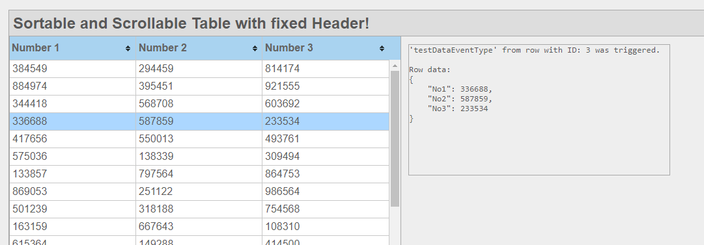
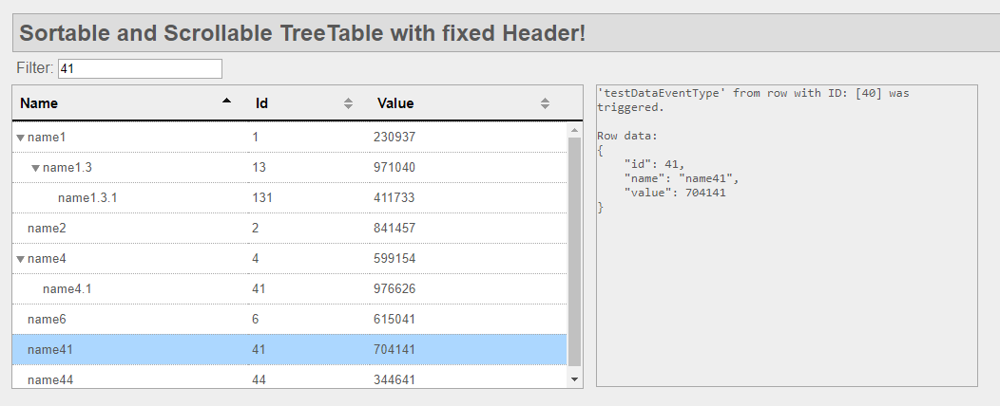

# Sortable And Scrollable TreeTable With Fixed Header

The file [scrollableTable.js](/js/scrollableTable.js) creates a sortable and scrollable table with fixed headers for HTML webpages. It uses jquery and css.

## Features
* Table can be used as TreeTable
* Table is scrollable
* Table columns can be sorted
* Table height can be set statically or as function which dynamically adjusts the height of the table. (See example in index.html)
* By clicking on a row an event is sent which can be caught for data processing. (Only single selected row implemented.)

## Example
An example is implemented in [index.html](index.html). You can just clone/download this repository and run it. No other dependencies are needed.

## TreeTable Version
An example is implemented in [treeTable.html](treeTable.html).

