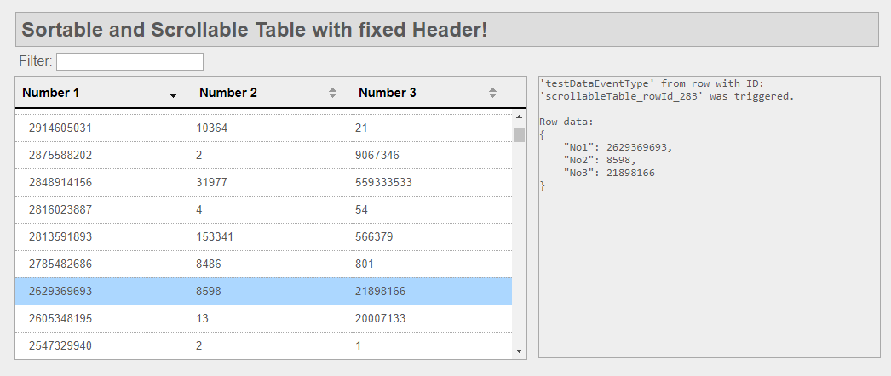
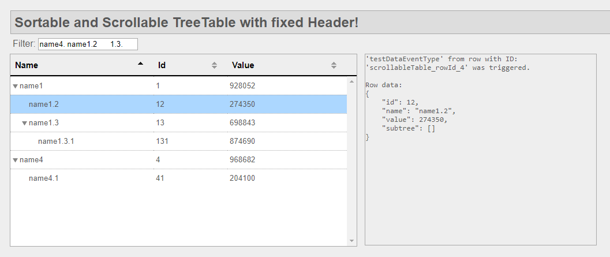

# Sortable And Scrollable Table With Fixed Header

The file [scrollableTable.js](/js/scrollableTable.js) creates a sortable and scrollable table with fixed headers for HTML webpages. It uses jquery and css.

## Features
* Table is scrollable
* Table columns can be sorted (See [jquery tablesorter](https://github.com/Mottie/tablesorter) which is used in here.)
* Table hight will be adjusted when window size changes
* By clicking on a row an event is sent which can be caught for data processing. (Only single selected row is implemented.)

## Example
An example is implemented in [index.html](index.html). You can just clone/download this repository and run it. No other dependencies are needed.

## Recently added TreeTable

